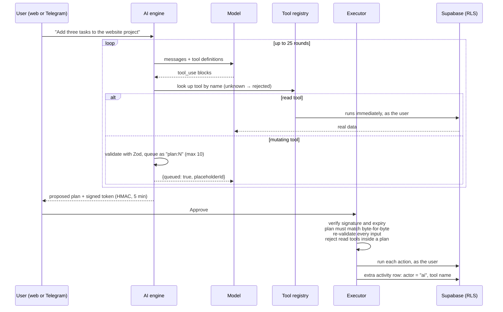

# Shalev CRM — A Personal Operating System with an AI Operator

> **Portfolio showcase.** This repository presents the design and a few selected pieces of a
> system I built and use every day. It is not the full source code, it is not runnable, and it is
> not licensed for reuse. See [NOTICE.md](NOTICE.md).

One system for the parts of a life that normally live in a dozen disconnected tools, and for
the connections between them. It is built deliberately for exactly one user, which makes it
possible to make decisions that a product for everyone never could.

**Stack:** Next.js 16 · React 19 · TypeScript · Supabase (Postgres + RLS) · Anthropic SDK ·
Telegram Bot API · Zod · Tailwind CSS · Vitest

---

## The problem

Tasks live in one app, documents in another, and an idea sits in a note that disappears. None
of them talk to each other. The cost isn't the inconvenience; it's the missing picture. You
can't ask *"where does this project actually stand?"* and get a whole answer, because half of
the answer lives somewhere else.

## What it is today

| Area | Status |
|---|---|
| Projects, Tasks, Ideas, Notes, Inbox | Live |
| Favorites, Activity timeline, Trash (soft delete + restore) | Live |
| AI Command Center (web) and a Telegram interface | Live |
| Jobs: a board fed by a separate autonomous job-search agent | Live |
| Calendar: important dates, reminder planning, gesture ideas | Live |
| AI usage and cost dashboard, Settings, Integrations | Live |
| Real estate, Investments, Banking, Travel, Work, Contacts, Files | Designed; screens are placeholders |

The navigation, routing and "Universal Add" picker are all driven by a single registry, so
adding a new area is a data change, not a layout change. The roadmap and the decision log
record what comes next and why.

## How I thought about it

### 1. The AI is an operator, not a chatbot, and it cannot be talked out of the rules

The AI layer can read, create and update data, but **only through a fixed registry of typed
tools**. It never gets raw SQL. There is no permanent-delete tool at all, and financial
integrations are designed to start read-only.



Key properties:

- **Proposals, not actions.** A mutating tool call never executes during the model loop. It
  becomes a numbered proposal, and later actions can reference earlier ones (`"plan:1"`).
- **The approval policy is a pure function** with no I/O and no model input, so nothing the
  model produces can change its answer ([`approval-policy.ts`](excerpts/ai/approval-policy.ts)).
- **The signed token proves integrity; it doesn't grant permission.** Even with a valid
  signature, the executor re-parses every input and re-checks every tool
  ([`execute.ts`](excerpts/ai/execute.ts)).
- **No privileged client.** Tool handlers receive an intentionally empty context and call the
  same server actions a human would, under the user's own session. Row-Level Security applies
  to the AI exactly as it does to the user.

→ [decision: controlled tools](docs/decisions/001-controlled-ai-tools.md) ·
[decision: signed approval](docs/decisions/002-signed-approval-plans.md)

### 2. Telegram is another interface, not a bypass

A thought can be captured from the phone before anyone decides where it belongs. The Telegram
webhook, however, arrives with no browser cookie, and the rule is that nothing reachable from
user input or from the AI may use the Supabase service-role key.

The solution: a real user session, bootstrapped once, is injected per request through
`AsyncLocalStorage`. Every existing server action calls `createClient()` unchanged and simply
receives the right identity ([`supabase-server-client.ts`](excerpts/data/supabase-server-client.ts)).
Approval happens asynchronously through inline buttons, so the plan is stored in a pending-actions
row, and the button carries only a short ID. Status changes use a compare-and-swap update, so
tapping *Approve* twice executes the plan once
([`pending-actions.ts`](excerpts/telegram/pending-actions.ts)).

→ [decision](docs/decisions/003-telegram-identity-and-async-approval.md)

### 3. "What counts as a thing?"

For anything to connect to anything, one data model has to hold objects that have almost
nothing in common, like a property, a task and an idea, without forcing a fake shape onto them
and without becoming a dumping ground. I rejected a universal `entities` table:

- **Typed tables** hold the structured domains, with purpose-fit columns and `CHECK` constraints.
- **Cross-cutting features** (notes, favorites, activity, custom fields) attach to any record
  through an `entity_type` + `entity_id` reference, so each feature is built once.
- The list of valid types lives in code, in one place
  ([`entity-types.ts`](excerpts/data/entity-types.ts)), because a polymorphic reference cannot be
  a real foreign key.
- Custom fields are `JSONB` with a GIN index, not an entity-attribute-value (EAV) schema.

→ [decision](docs/decisions/004-hybrid-data-model.md)

### 4. The audit trail is reliable by construction

Activity is written by **database triggers**, not by application code that has to remember to
call a logger. The triggers are selective: they record creations, meaningful status changes,
moves, soft deletes and restores, not every column touch
([`activity_logging_triggers.sql`](excerpts/database/activity_logging_triggers.sql)). AI actions
add a second row that names the tool, which is a deliberate and documented exception.

→ [decision](docs/decisions/005-trigger-based-activity-log.md)

### 5. Security that was actually tested

Every table has row-level security with four owner-only policies
([`create_tasks.sql`](excerpts/database/create_tasks.sql)). Live testing still turned up a real
bug: tables created by migrations had inherited a restrictive default ACL, so Postgres rejected
requests *before* RLS was ever evaluated. Queries run as a superuser can never show this. The
fix became a rule: every migration grants privileges explicitly.

→ [decision](docs/decisions/006-explicit-grants-after-rls.md)

### 6. Logic that can't be tested doesn't belong in a cron job

The Calendar module doesn't just "remind me on a date". It skips a weekly gesture in a week that
already holds a major occasion, suggests something when a long stretch has nothing positive in
it, and caps how many reminders land in one week. That logic is a **pure function**
(`today` is a parameter, not a clock read), and the nightly job is a thin shell around it.
Idempotency is guaranteed by a unique index, not by convention.

→ [decision](docs/decisions/007-pure-planner-idempotent-job.md)

### 7. Two repositories, one written contract

The Jobs module is fed by a separate job-search agent that lives in its own repository. The two
share a database schema, not code. A contract file, kept identical in both repositories, defines
who owns each table and each field. The most important line in it: **the agent can read my
decisions but has no write path to them**, which is what keeps its feedback loop honest.

→ The agent has its own showcase: [job-agent-showcase](https://github.com/shalev123223/job-agent-showcase)

## Engineering practice

- **Decisions come before code.** 30+ architecture decision records, each with context,
  decision and consequences, including the ones that reversed earlier choices.
- **Around 46 Vitest suites** sit next to the code: the AI engine, the executor, the tool
  registry, the Telegram handler and the calendar planner are all covered.
- **The AI provider is abstracted.** Nothing outside one folder imports the vendor SDK.
- **Secrets never live in the repository.** Webhook and cron endpoints verify shared secrets
  with timing-safe comparison and fail closed.

## Repository map

```
docs/
  architecture.md            layers, boundaries, request paths
  decisions/                 selected architecture decision records
excerpts/
  ai/                        tool registry, approval policy, engine loop, executor
  telegram/                  webhook entry point, async approval state machine
  data/                      entity model, soft-delete helpers, per-request identity
  database/                  a table with RLS, trigger-based activity logging
```

## What is intentionally not here

The full application, the complete schema, personal data, environment configuration and
anything that identifies accounts or infrastructure.

---

Built by **Shalev Menachem** · [Portfolio](https://shalevpro.shalevmenahem.com/)
